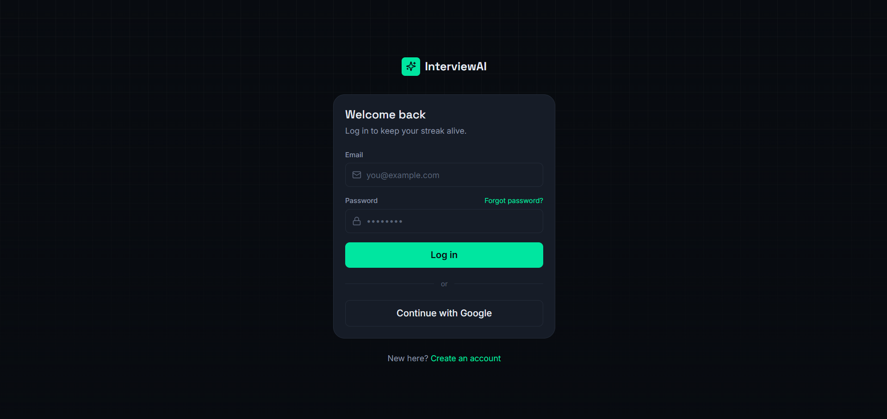
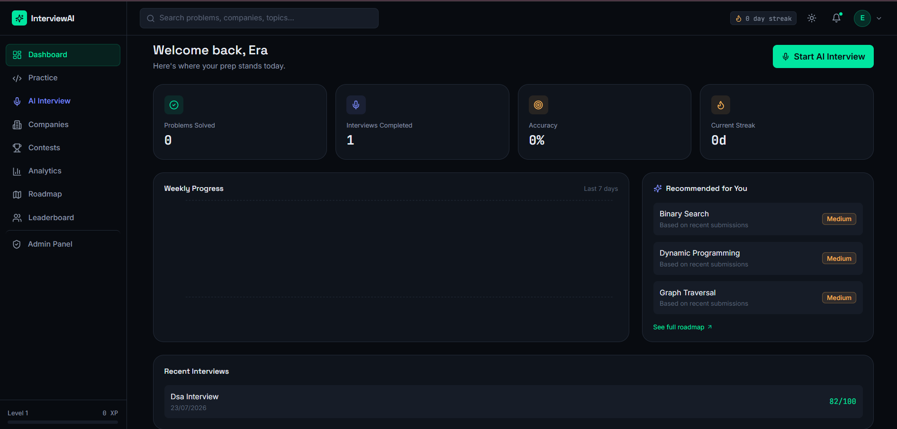
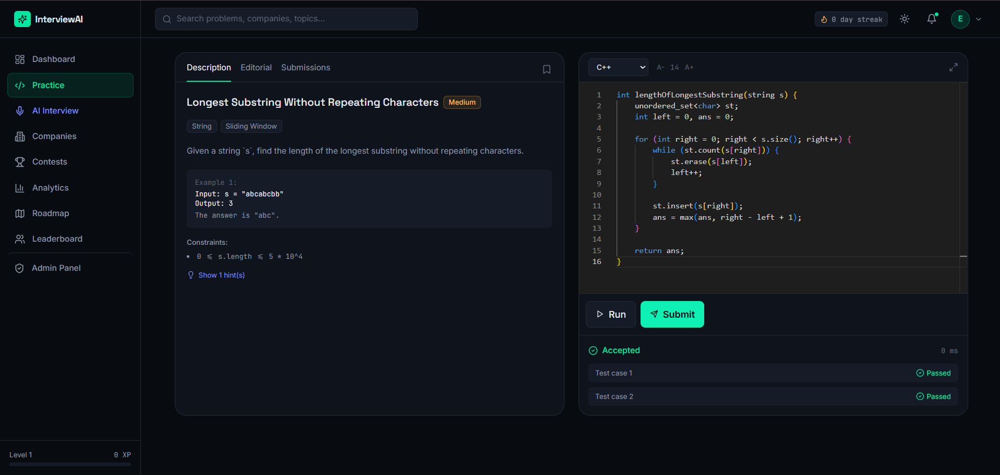
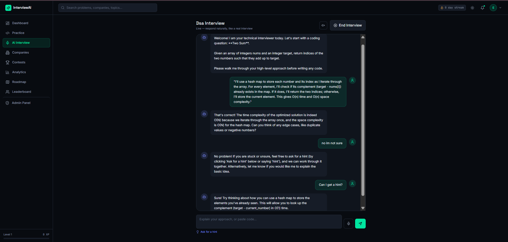
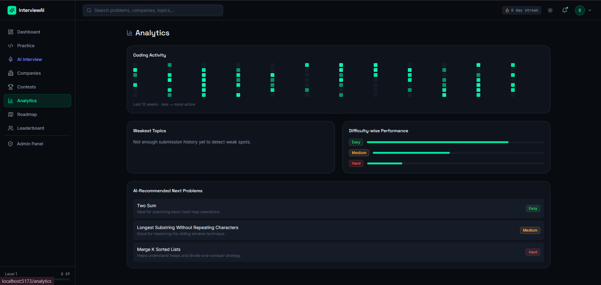
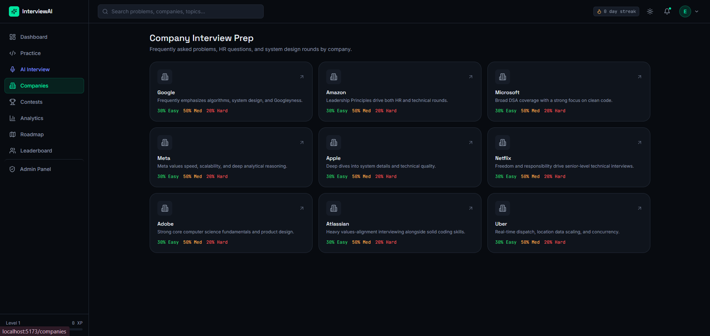
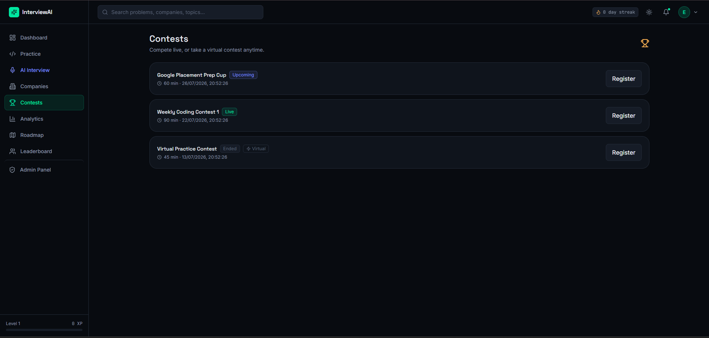
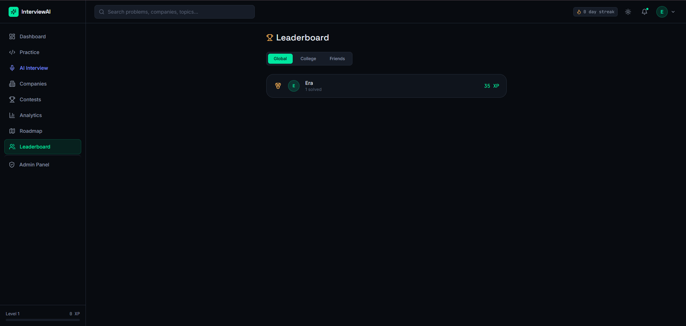
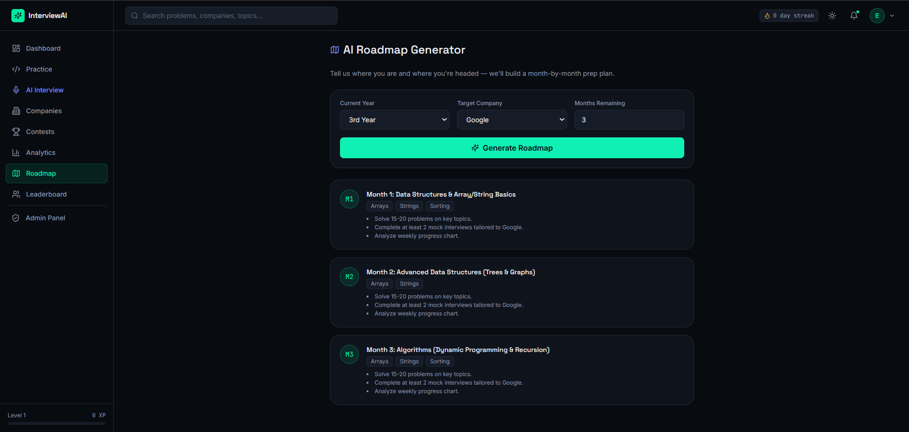
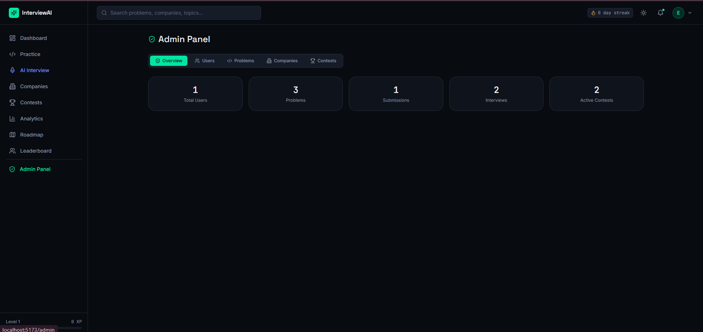

# 🚀 InterviewAI – AI-Powered Coding Interview Preparation Platform


> A full-stack AI-powered interview preparation platform.

🔗 **Live Demo:** [InterviewAI](https://interviewai-p7fm.onrender.com/)

<p align="center">

### Build • Practice • Analyze • Improve

A production-ready AI-powered coding interview preparation platform that helps software engineering candidates master technical interviews through AI-driven mock interviews, coding practice, company-specific preparation, contests, analytics, and personalized learning roadmaps.

**Built with React, Node.js, Express, MongoDB, OpenAI API, Judge0, Socket.IO, and TypeScript.**

</p>

---

# 📖 Overview

InterviewAI is a full-stack coding interview preparation platform inspired by modern interview ecosystems such as **LeetCode**, **HackerRank**, and **Interviewing.io**. It combines an online coding environment, AI-powered interview simulation, real-time performance analytics, coding contests, gamification, and personalized learning into a single platform.

The project follows a scalable production-style architecture with separate frontend and backend applications, secure JWT authentication, RESTful APIs, real-time communication using Socket.IO, MongoDB for data persistence, and integrations with OpenAI and Judge0 APIs.

---

# ✨ Highlights

- 🤖 AI-Powered Mock Interviews
- 💻 Online Code Editor with Judge0 Integration
- 📊 Advanced Performance Analytics
- 🏢 Company-Specific Interview Preparation
- 🏆 Coding Contests & Leaderboards
- 🧠 AI Roadmap Generator
- 📄 AI Resume Analysis
- 🔐 Secure JWT Authentication
- 🌙 Responsive Dark UI
- ⚡ Real-Time Communication using Socket.IO

 ---

# ✨ Features

## 🤖 AI Interview Assistant

- AI-powered technical & HR mock interviews
- Interactive interview chat
- AI-generated interview evaluation
- Strengths & weaknesses analysis
- Personalized improvement suggestions
- Voice input support using Web Speech API
- Real-time interview experience with Socket.IO

---

## 💻 Coding Practice

- Monaco-powered online code editor
- Multi-language code execution
- Judge0 API integration
- Company-specific coding questions
- Topic-wise & difficulty-wise filtering
- Submission history
- AI explanation for submitted solutions

---

## 📊 Dashboard

- Problems solved tracker
- Interview statistics
- Accuracy tracking
- Daily streak system
- Weekly progress analytics
- Personalized recommendations

---

## 📈 Analytics

- Performance visualization
- Submission history
- Difficulty breakdown
- Weak topic analysis
- Activity heatmap
- AI-generated learning insights

---

## 🛣️ AI Roadmap Generator

- Personalized learning roadmap
- Skill gap analysis
- Topic recommendations
- Structured interview preparation

---

## 🏢 Company Preparation

- Company-wise coding questions
- HR interview questions
- System Design interview preparation
- Curated interview roadmaps

---

## 🏆 Coding Contests

- Participate in coding contests
- Contest registration
- Live rankings
- Contest leaderboards
- Performance evaluation

---

## 🥇 Gamification

- XP System
- Levels
- Daily Streaks
- Badges
- Achievements
- Global Leaderboard

---

## 👨‍💼 Admin Dashboard

- User Management
- Problem Management
- Contest Management
- Analytics Overview
- CRUD Operations

---

## 🔐 Authentication & Security

- JWT Authentication
- Google OAuth Login
- Secure Cookies
- Password Reset
- Protected Routes
- Role-Based Authorization

---

## 🌙 User Experience

- Responsive Design
- Dark Theme
- Modern Dashboard
- Fast Search
- Clean UI
- Mobile Friendly

---

# 🏗️ System Architecture

```text
                   ┌────────────────────────────┐
                   │      React + Vite UI       │
                   └─────────────┬──────────────┘
                                 │
                   REST APIs + Socket.IO
                                 │
                ┌────────────────▼────────────────┐
                │      Express.js Backend         │
                └────────────────┬────────────────┘
                                 │
       ┌──────────────┬──────────┴───────────┬──────────────┐
       │              │                      │              │
       ▼              ▼                      ▼              ▼
   MongoDB        OpenAI API            Judge0 API      Google OAuth
(Database)     AI Interviewer       Code Execution    Authentication
```

---

# 🛠️ Tech Stack

## Frontend

- React
- TypeScript
- Vite
- Tailwind CSS
- React Router
- Axios
- Monaco Editor
- Recharts
- Socket.IO Client

---

## Backend

- Node.js
- Express.js
- MongoDB
- Mongoose
- JWT Authentication
- Socket.IO
- REST APIs

---

## AI & External Services

- OpenAI API
- Judge0 API
- Google OAuth
- Nodemailer

---

# 📈 Project Statistics

| Category | Details |
|----------|---------|
| Architecture | Full Stack MERN |
| Frontend | React + TypeScript |
| Backend | Node.js + Express |
| Database | MongoDB |
| Authentication | JWT + Google OAuth |
| AI Integration | OpenAI API |
| Code Execution | Judge0 API |
| Real-Time | Socket.IO |
| UI | Tailwind CSS |

---

# 📂 Project Structure

```text
InterviewAI
│
├── backend
│   ├── config
│   ├── controllers
│   ├── middleware
│   ├── models
│   ├── routes
│   ├── services
│   ├── utils
│   └── server.js
│
├── frontend
│   ├── assets
│   ├── components
│   ├── context
│   ├── hooks
│   ├── pages
│   ├── services
│   ├── types
│   └── App.tsx
│
└── README.md
```

---

# 🚀 Getting Started

## 1️⃣ Clone Repository

```bash
git clone https://github.com/prigya-goyal/InterviewAI.git
cd InterviewAI
```

---

## 2️⃣ Backend Setup

```bash
cd backend
cp .env.example .env

# Configure your environment variables:
# MONGO_URI
# JWT_SECRET
# OPENAI_API_KEY
# GOOGLE_CLIENT_ID
# JUDGE0_API_KEY

npm install
npm run seed
npm run dev
```

Backend runs on:

```
http://localhost:5000
```

---

## 3️⃣ Frontend Setup

```bash
cd frontend
cp .env.example .env
npm install
npm run dev
```

Frontend runs on:

```
http://localhost:5173
```

---

## 4️⃣ Admin Access

After creating an account, update the user's role inside MongoDB:

```javascript
db.users.updateOne(
  { email: "you@example.com" },
  { $set: { role: "admin" } }
)
```

---

# 🔑 Environment Variables

Create a `.env` file inside the backend directory.

```env
NODE_ENV=development
PORT=5000

MONGO_URI=

JWT_SECRET=

GOOGLE_CLIENT_ID=

OPENAI_API_KEY=

JUDGE0_API_KEY=

SMTP_HOST=
SMTP_PORT=
SMTP_USER=
SMTP_PASS=
```

---

# ✅ Implemented Features

✔ JWT Authentication

✔ Google OAuth Login

✔ AI Mock Interviews

✔ Coding Practice Platform

✔ Judge0 Code Execution

✔ AI Code Explanation

✔ Resume Analysis

✔ Company Preparation

✔ Coding Contests

✔ Analytics Dashboard

✔ AI Roadmap Generator

✔ XP & Achievement System

✔ Leaderboards

✔ Admin Dashboard

✔ Dark Theme

✔ Responsive Design

✔ Real-Time Communication using Socket.IO

---

# 💡 Engineering Highlights

- Modular MERN Architecture
- RESTful API Design
- MVC Backend Architecture
- Component-Based Frontend
- Secure JWT Authentication
- Protected Routes
- Socket.IO Real-Time Communication
- Environment-Based Configuration
- Clean Folder Structure
- Scalable Codebase

---

# 📸 Application Preview

### 🔐 Login


### 🏠 Dashboard


### 💻 Coding Practice


### 🤖 AI Interview


### 📊 Analytics


### 🏢 Companies


### 🏆 Coding Contests


### 🥇 Leaderboard


### 🗺️ AI Roadmap


### ⚙️ Admin Panel


---

# 🚀 Future Enhancements

- AI Resume Builder
- ATS Resume Checker
- Voice-Based AI Interviewer
- Video Interview Simulation
- AI Career Coach
- Docker Deployment
- CI/CD Pipeline
- Kubernetes Deployment
- Mobile Application
- Microservices Architecture

---

# 🤝 Contributing

Contributions are welcome!

1. Fork the repository
2. Create your feature branch

```bash
git checkout -b feature-name
```

3. Commit your changes

```bash
git commit -m "Add new feature"
```

4. Push to GitHub

```bash
git push origin feature-name
```

5. Open a Pull Request

---

# 📜 License

This project is licensed under the MIT License.

---

# 👩‍💻 Author

## Prigya Goyal

**B.Tech Computer Engineering Student**

GitHub: https://github.com/prigya-goyal

LinkedIn: https://www.linkedin.com/in/prigya-goyal-95aa79286/

---

